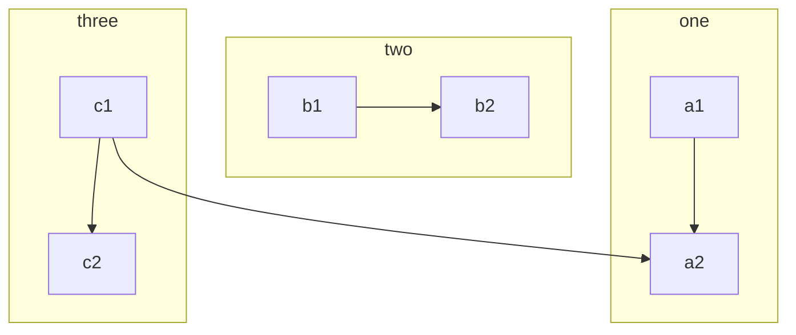

架构文摘 2022-01-23 12:57

## 一、Nginx 安装

### 1、去官网[http://nginx.org/下载对应的 nginx](http://nginx.org/%E4%B8%8B%E8%BD%BD%E5%AF%B9%E5%BA%94%E7%9A%84nginx)包，推荐使用稳定版本

### 2、上传 nginx 到 linux 系统

### 3、安装依赖环境

#### (1)安装 gcc 环境

```shell
yum install gcc-c++
```

#### (2)安装 PCRE 库，用于解析正则表达式

```shell
yum install -y pcre pcre-devel
```

#### (3)zlib 压缩和解压缩依赖

```shell
yum install -y zlib zlib-devel
```

#### (4)SSL 安全的加密的套接字协议层，用于 HTTP 安全传输，也就是 https

```shell
yum install -y openssl openssl-devel
```

### 4、解压，需要注意，解压后得到的是源码，源码需要编译后才能安装

```shell
tar -zxvf nginx-1.16.1.tar.gz
```

### 5、编译之前，先创建 nginx 临时目录，如果不创建，在启动 nginx 的过程中会报错

```shell
mkdir /var/temp/nginx -p
```

### 6、在 nginx 目录，输入如下命令进行配置，目的是为了创建 makefile 文件

```shell
./configure
--prefix=/usr/local/nginx
--pid-path=/var/run/nginx/nginx.pid
--lock-path=/var/lock/nginx.lock
--error-log-path=/var/log/nginx/error.log
--http-log-path=/var/log/nginx/access.log
--with-http_gzip_static_module
--http-client-body-temp-path=/var/temp/nginx/client
--http-proxy-temp-path=/var/temp/nginx/proxy
--http-fastcgi-temp-path=/var/temp/nginx/fastcgi
--http-uwsgi-temp-path=/var/temp/nginx/uwsgi
--http-scgi-temp-path=/var/temp/nginx/scgi
```

注：代表在命令行中换行，用于提高可读性配置命令：

|              命令              |                  解释                  |
| :----------------------------: | :------------------------------------: |
|            --prefix            |            指定 nginx 目录             |
|           --pid-path           |           指定 nginx 的 pid            |
|          --lock-path           |   锁定安装文件，防止恶意篡改或误操作   |
|        --error-log-path        |              错误日志目录              |
|        --http-log-path         |                  日志                  |
| --with-http_gzip_static_module | 启用 gzip 模块，在线实时压缩输出数据流 |
|  --http-client-body-temp-path  |         设置客户端请求临时目录         |
|     --http-proxy-temp-path     |         设置 http 代理临时目录         |
|    --http-fastcgi-temp-path    |          设置 fastcg 临时目录          |
|     --http-uwsgi-temp-path     |          设定 uwsgi 临时目录           |
|     --http-scgi-temp-path      |           设置 scgi 临时目录           |

7、make 编译&安装

```shell
make
make install
```

### 8、进入 sbin 目录启动 nginx

```shell
启动：nginx
停止：./nginx -s stop
重新加载：./nginx -s reload
```

## 二、配置反向代理

### 1、配置 upstream

```shell
upstream [proxyName] {
    server 192.168.1.173:8080;
    server 192.168.1.174:8080;
    server 192.168.1.175:8080;
}
```

### 2、配置 server

```shell
server {
    listem  80;
    server_name www.tomcats.com;    location / {
        proxy_pass http://tomcats;
    }
}
```

## 三、配置负载均衡

nginx 默认采用轮训的方式进行负载均衡

### 1、使用加权轮询

```shell
upstream [proxyName] {
    server 192.168.1.173:8080 weight=1;
    server 192.168.1.174:8080 weight=5;
    server 192.168.1.175:8080 weight=2;
}
```

### 2、hash 负载均衡

```shell
upstream [proxyName] {
    ip_hash
    server 192.168.1.173:8080;
    server 192.168.1.174:8080;
    server 192.168.1.175:8080;
}
```

hash 算法实际上只会计算 192.168.1 这段做哈希

使用 ip_hash 的注意点：

不能把后台服务器直接移除，只能标记 down.

### 3、url hash 负载均衡

```shell
upstream [proxyName] {
    hash $request_url;
    server 192.168.1.173:8080;
    server 192.168.1.174:8080;
    server 192.168.1.175:8080;
}
```

### 4、最小连接负载均衡

```shell
upstream [proxyName] {
    least_conn;
    server 192.168.1.173:8080;
    server 192.168.1.174:8080;
    server 192.168.1.175:8080;
}
```

## 四、upstream 指令参数

`max_conns`：限制最大同时连接数 1.11.5 之前只能用于商业版

`slow_start`：单位秒，权重在指定时间内从 1 上升到指定值，不适用与 hash 负载均衡、随机负载均衡 如果在 upstream 中只有一台 server，则该参数失效（商业版才有）

`down`：禁止访问

`backup`：备用机 只有在其他服务器无法访问的时候才能访问到 不适用与 hash 负载均衡、随机负载均衡

`max_fails`：表示失败几次，则标记 server 已宕机，剔出上游服务 默认值 1

`fail_timeout`：表示失败的重试时间 默认值 10

### 1、keepalived

```shell
upstream [proxyName] {
    server 192.168.1.173:8080 weight=1;
    server 192.168.1.174:8080 weight=5;
    server 192.168.1.175:8080 weight=2;
    keepalive 32; #保持的连接数
}
server {
    listem  80;
    server_name www.tomcats.com;    location / {
        proxy_pass http://tomcats;
        proxy_http_version 1.1; #连接的协议版本
        proxy_set_header Connection ""; 清空连接请求头
    }
}
```

### 2、控制浏览器缓存

```shell
server {
    listem  80;
    server_name www.tomcats.com;

    location / {
        proxy_pass http://tomcats;
               expires 10s;  #浏览器缓存10秒钟
               #expires @22h30m  #在晚上10点30的时候过期
               #expires -1h  #缓存在一小时前时效
               #expires epoch  #不设置缓存
               #expires off  #缓存关闭，浏览器自己控制缓存
               #expires max  #最大过期时间
    }
}
```

### 3、反向代理缓存

```shell
upstream [proxyName] {
    server 192.168.1.173:8080 weight=1;
    server 192.168.1.174:8080 weight=5;
    server 192.168.1.175:8080 weight=2;
}
#proxy_cache_path 设置缓存保存的目录的位置
#keys_zone设置共享内以及占用的空间大小
#mas_size 设置缓存最大空间
#inactive 缓存过期时间，错过此时间自动清理
#use_temp_path 关闭零时目录
proxy_cache_path /usr/local/nginx/upsteam_cache keys_zone=mycache:5m max_size=1g inactive=8h use_temp_path=off;
server {
    listem  80;
    server_name www.tomcats.com;
    #开启并使用缓存
    proxy_cache mycache;
    #针对200和304响应码的缓存过期时间
    proxy_cache_valid 200 304 8h;

    location / {
        proxy_pass http://tomcats;
    }
}
```

## 五、配置 ssl 证书提供 https 访问

### 1. 安装 SSL 模块

要在 nginx 中配置 https，就必须安装 ssl 模块，也就是: `http_ssl_module`。

进入到 nginx 的解压目录：`/home/software/nginx-1.16.1`

新增 ssl 模块(原来的那些模块需要保留)

```shell
./configure --prefix=/usr/local/nginx
--pid-path=/var/run/nginx/nginx.pid
--lock-path=/var/lock/nginx.lock
--error-log-path=/var/log/nginx/error.log
--http-log-path=/var/log/nginx/access.log
--with-http_gzip_static_module
--http-client-body-temp-path=/var/temp/nginx/client
--http-proxy-temp-path=/var/temp/nginx/proxy
--http-fastcgi-temp-path=/var/temp/nginx/fastcgi
--http-uwsgi-temp-path=/var/temp/nginx/uwsgi
--http-scgi-temp-path=/var/temp/nginx/scgi
--with-http_ssl_module
```

编译和安装

```shell
make
make install
```

### 2、配置 HTTPS

把 ssl 证书 _.crt 和 私钥_.key 拷贝到/usr/local/nginx/conf 目录中。

新增 server 监听 443 端口：

```shell
server {
listen 443;
server_name www.imoocdsp.com; # 开启 ssl
ssl on; # 配置 ssl 证书
ssl_certificate 1_www.imoocdsp.com_bundle.crt; # 配置证书秘钥
ssl_certificate_key 2\_www.imoocdsp.com.key; # ssl 会话 cache
ssl_session_cache shared:SSL:1m; # ssl 会话超时时间
ssl_session_timeout 5m; # 配置加密套件，写法遵循 openssl 标准
ssl_protocols TLSv1 TLSv1.1 TLSv1.2;
ssl_ciphers ECDHE-RSA-AES128-GCM-SHA256:HIGH:!aNULL:!MD5:!RC4:!DHE;
ssl_prefer_server_ciphers on;
location / {
        proxy_pass http://tomcats/;
        index  index.html index.htm;
    }}
```

## 六、配置 ha nginx

### 1、安装 keepalived

#### (1)下载

```http
https://www.keepalived.org/download.html
```

#### (2)解压

```shell
tar -zxvf keepalived-2.0.18.tar.gz
```

#### (3)使用 configure 命令配置安装目录与核心配置文件所在位置：

```shell
./configure --prefix=/usr/local/keepalived --sysconf=/etc
```

`prefix`：keepalived 安装的位置 sysconf：keepalived 核心配置文件所在位置，固定位置，改成其他位置则 keepalived 启动不了，`/var/log/messages`中会报错

`sysconf`：keepalived 核心配置文件所在位置，固定位置，改成其他位置则 keepalived 启动不了，`/var/log/messages` 中会报错

配置过程中可能会出现警告信息，如下所示：

```shell
*** WARNING - this build will not support IPVS with IPv6. Please install libnl/libnl-3 dev libraries to support IPv6 with IPVS.
# 安装 libnl/libnl-3 依赖
yum -y install libnl libnl-devel
```

#### (4)安装 keepalived

```shell
make && make install
```

#### (5)配置文件 在 `/etc/keepalived/keepalived.conf`

#### (6)忘记安装配置的目录，则通过如下命令找到：

```shell
whereis keepalived
```

#### (7)启动 keepalived

进入 sbin 目录

```shell
./keepalived
```

### 2、配置 keepalived 主机

#### (1)通过命令 vim keepalived.conf 打开配置文件

```shell
global_defs {
 # 路由 id：当前安装 keepalived 的节点主机标识符，保证全局唯一
 router_id keep_171
}
vrrp_instance VI_1 {
    # 表示状态是 MASTER 主机还是备用机 BACKUP
    state MASTER
    # 该实例绑定的网卡
    interface ens33
    # 保证主备节点一致即可
    virtual_router_id 51
    # 权重，master 权重一般高于 backup，如果有多个，那就是选举，谁的权重高，谁就当选
    priority 100
    # 主备之间同步检查时间间隔，单位秒
    advert_int 2
    # 认证权限密码，防止非法节点进入
    authentication {
    auth_type PASS
    auth_pass 1111
    }
    # 虚拟出来的 ip，可以有多个（vip）
    virtual_ipaddress {
        192.168.1.161
    }
}
```

附：查看网卡信息命令

```shell
ip addr
```

#### (2)启动 keepalived

#### (3)查看进程

```shell
ps -ef|grep keepalived
```

#### (4)查看 vip(虚拟 ip)

在网卡 ens33 下，多了一个 `192.168.1.161`，这个就是虚拟 ip

### 3、把 keepalived 注册为系统服务

#### (1)拷贝配置文件

将 keepalived 目录下 `etc/init.d/keepalived` 拷贝到 `/etc/init.d/`下
将 keepalived 目录下 `etc/sysconfig/keepalived` 拷贝到 `/etc/sysconfig/`下

#### (2)刷新 systemctl

```shell
systemctl daemon-reload
```

#### (3)启动、停止、重启 keepalived

```shell
# 启动
systemctl start keepalived.service
#停止
systemctl stop keepalived.service
#重启
systemctl restart keepalived.service
```

### 4、实现双机主备高可用




#### (1)修改备机配置

```shell
global_defs {
    router_id keep_172
}
vrrp_instance VI_1 {
    # 备用机设置为 BACKUP
    state BACKUP
    interface ens33
    virtual_router_id 51
    # 权重低于 MASTER
    priority 80
    advert_int 2
    authentication {
    auth_type PASS auth_pass 1111
    }
    virtual_ipaddress {
        # 注意：主备两台的 vip 都是一样的，绑定到同一个 vip
        192.168.1.161
    }
}
```

#### (2) 启动 Keepalived

#### (3) 访问 vip 即可访问主机，当主机失效时访问 vip 就会访问到备机

### 5、keepalived 配置 nginx 自动重启

#### (1)编写脚本

在 `/etc/keepalived/`下创建脚本 `check_nginx_alive_or_not`

```shell
#!/bin/bash

A=`ps -C nginx --no-header |wc -l`

# 判断 nginx 是否宕机，如果宕机了，尝试重启

if [ $A -eq 0 ];then
/usr/local/nginx/sbin/nginx # 等待一小会再次检查 nginx，如果没有启动成功，则停止 keepalived，使其启动备用机
sleep 3
if [ `ps -C nginx --no-header |wc -l` -eq 0 ];then
killall keepalived
fi
fi
```

#### (2)添加运行权限

```shell
chmod +x /etc/keepalived/check_nginx_alive_or_not.sh
```

#### (3)配置 keepalived 监听 nginx 脚本

```shell
vrrp_script check_nginx_alive {
script "/etc/keepalived/check_nginx_alive_or_not.sh"
interval 2 # 每隔两秒运行上一行脚本
weight 10 # 如果脚本运行失败，则升级权重+10
}
```

#### (4)在 vrrp_instance 中新增监控的脚本

```shell
track_script {
check_nginx_alive # 追踪 nginx 脚本
}
```

#### (5)重启 Keepalived 使得配置文件生效

```shell
systemctl restart keepalived
```

### 6、keepalived 双主热备

#### (1)配置 DNS 轮询

在同一个域名下配置两个 ip，自行百度

#### (2)配置第一台主机

```shell
global_defs {
    router_id keep_171
}
vrrp_instance VI_1 {
    state MASTER i
    nterface ens33
    virtual_router_id 51
    priority 100
    advert_int 1
    authentication {
        auth_type PASS
        auth_pass 1111
    }
    virtual_ipaddress {
        192.168.1.161
    }
}

vrrp_instance VI_2 {
    state BACKUP
    interface ens33
    virtual_router_id 52
    priority 80
    advert_int 1
    authentication {
        auth_type PASS
        auth_pass 1111
    }
    virtual_ipaddress {
        192.168.1.162
    }
}
```

#### (3)配置第二台主机

```shell
global_defs {
    router_id keep_172
}
vrrp_instance VI_1 {
    state BACKUP
    interface ens33
    virtual_router_id 51
    priority 80
    advert_int 1
    authentication {
        auth_type PASS
        auth_pass 1111
    }
    virtual_ipaddress {
        192.168.1.161
    }
}

vrrp_instance VI_2 {
    state MASTER
    interface ens33
    virtual_router_id 52
    priority 100
    advert_int 1
    authentication {
        auth_type PASS
        auth_pass 1111
    }
    virtual_ipaddress {
       192.168.1.162
    }
}
```

#### (4)重启两台 Keepalived

```shell
systemctl restart keepalived
```

## 七、LVS（Linux Virtual Server）实现高可用负载均衡

### 1、为什么要使用 LVS+Nginx

lvs 基于四层负载均衡，工作效率较 Nginx 的七层负载更高，使用 LVS 搭建 Nginx 集群，可以提高性能
四层负载均衡无法对信息处理，只能通过 ip+端口的形式转发，所以需要七成负载进行数据的处理
Nginx 接收请求来回，LVS 可以只接受不响应

### 2、LVS 的三种模式

#### (1)NAT 模式

客户端将请求发往 LVS，LVS 会选择一台服务器响应请求，服务器将结果返回给 LVS，LVS 再返回给客户端。
在 NAT 模式中，服务器的网关必须指向 LVS，否则报文无法送达客户端
NAT 技术将请求的报文和响应的报文都需要通过 LVS 进行地址改写，因此网站访问量比较大的时候负载均衡调度器有比较大的瓶颈，一般要求最多之能 10-20 台节点
NAT 模式支持对 IP 地址和端口进行转换。即用户请求的端口和真实服务器的端口可以不一致

#### (2)TUN 模式

客户端将请求发往 LVS，LVS 会选择一台服务器响应请求，在客户端与服务器之间建立隧道，返回结果的时候直接由服务器返回响应，不在经过 LVS。
TUN 模式必须所有的服务器上都绑定 VIP 的 IP 地址，所有的服务器都必须有网卡。
TUN 模式走隧道运维难度大，并且会直接暴露服务器地址
服务器将应答包直接发给用户。所以，减少了负载均衡器的大量数据流动，负载均衡器不再是系统的瓶颈，就能处理很巨大的请求量，这种方式，一台负载均衡器能够为很多服务器进行分发。而且跑在公网上就能进行不同地域的分发

#### (3)DR 模式

客户端将请求发往 LVS，LVS 会选择一台服务器响应请求，返回结果的时候通过统一的路由进行返回，不在经过 LVS。
和 TUN 模式一样，LVS 只是分发请求，应答包通过单独的路由返回给客户端，与 TUN 相比这种方式不需要隧道结构，可以兼容大多数的操作系统，同时统一路由可以隐藏真实的物理服务器。DR 模式效率更高，但配置更复杂.
所有服务器节点和 LVS 只能在一个局域网里面。

### 3、搭建 LVS-DR 模式

先关闭掉服务器上网络配置管理器，避免网络接口冲突

```shell
systemctl stop NetworkManager
systemctl disable NetworkManager
```

#### (1)创建子接口（创建 LVS 的虚拟 ip）

进入网卡配置目录/etc/sysconfig/network-scripts/,找到网卡配置文件，这里以 ifcfg-ens33 为例，拷贝并创建子接口

cp ifcfg-ens33 ifcfg-ens33:1
修改子接口配置如下

配置中的 192.168.1.150 就是 vip，是提供给外网用户访问的 ip 地址

```shell
DEVICE="ens33:1"
ONBOOT="yes"
IPADDR=192.168.1.150
NETMASK=255.255.255.0
BOOTPROTO=static
```

重启网络服务

```shell
service network restart
```

重启成功后，ip addr 查看一下，你会发现多了一个 ip，也就是虚拟 ip（vip）

注意：阿里云不支持配置网卡，需要购买相应的负载均衡服务，腾讯云支持配置网卡，但需要购买网卡支持，一个网卡支持 10 个虚拟 ip 配置

#### (2)安装 ipvsadm

如今的 centos 都集成了 LVS，所以 ipvs 是自带的，我们只需要安装 ipvsadm 即可（ipvsadm 是管理集群的工具，通过 ipvs 可以管理集群，查看集群等操作）

```shell
yum install ipvsadm
```

#### (3)配置服务器（RS）的虚拟 ip

进入网卡配置目录/etc/sysconfig/network-scripts/,找到 ifcfg-lo，拷贝并创建子接口

```shell
cp ifcfg-lo ifcfg-lo:1
```

修改子接口配置如下

```shell
DEVICE="lo:1"
IPADDR=192.168.1.150
NETMASK=255.255.255.255
NETWORK=127.0.0.0
BROADCAST=127.255.255.255
ONBOOT="yes"
NAME=loopback
```

重启网络服务成功后，ip addr 查看一下，你会发现多了一个 ip，也就是虚拟 ip（vip）

#### (4)为服务器（RS）配置 arp

ARP 响应级别与通告行为参数说明

```shell
arp-ignore：ARP 响应级别（处理请求）
0：只要本机配置了 ip，就能响应请求
1：请求的目标地址到达对应的网络接口，才会响应请求
arp-announce：ARP 通告行为（返回响应）
0：本机上任何网络接口都向外通告，所有的网卡都能接受到通告
1：尽可能避免本网卡与不匹配的目标进行通告 2：只在本网卡通告
```

打开 sysctl.conf:

vim /etc/sysctl.conf
配置所有网卡、默认网卡以及虚拟网卡的 arp 响应级别和通告行为，分别对应：all，default，lo

```shell
# configration for lvs

net.ipv4.conf.all.arp_ignore = 1
net.ipv4.conf.default.arp_ignore = 1
net.ipv4.conf.lo.arp_ignore = 1

net.ipv4.conf.all.arp_announce = 2
net.ipv4.conf.default.arp_announce = 2
net.ipv4.conf.lo.arp_announce = 2
```

刷新配置文件

```shell
sysctl -p
```

增加一个网关，用于接收数据报文，当有请求到本机后，会交给 lo 去处理

```shell
route add -host 192.168.1.150 dev lo:1
```

将网关添加至开机启动

```shell
echo "route add -host 192.168.1.150 dev lo:1" >> /etc/rc.local
```

#### (4)使用 ipvsadm 配置集群规则

创建 LVS 节点，用户访问的集群调度者

ipvsadm -A -t 192.168.1.150:80 -s rr -p 5
`-A`：添加集群
`-t`：tcp 协议 ip 地址：设定集群的访问
`ip`：也就是 LVS 的虚拟 ip
`-s`：设置负载均衡的算法，
`rr`：表示轮询
`-p`：设置连接持久化的时间,在指定时间内同一个用户的请求会访问到同一个服务器中
创建多台 RS 真实服务器

```shell
ipvsadm -a -t 192.168.1.150:80 -r 192.168.1.171:80 -g
ipvsadm -a -t 192.168.1.150:80 -r 192.168.1.172:80 -g
```

`-a`：添加真实服务器
`-t`：tcp 协议
`-r`：真实服务器的 ip 地址
`-g`：设定 DR 模式
保存到规则库，否则重启失效

```shell
ipvsadm -S
```

检查集群

```shell
# 查看集群列表
ipvsadm -Ln
 #查看集群状态
ipvsadm -Ln --stats
```

一些其他命令

```shell
# 重启 ipvsadm，重启后需要重新配置

service ipvsadm restart

# 查看持久化连接

ipvsadm -Ln --persistent-conn

# 查看连接请求过期时间以及请求源 ip 和目标 ip

ipvsadm -Lnc

# 设置 tcp tcpfin udp 的过期时间（一般保持默认）

ipvsadm --set 1 1 1

# 查看过期时间

ipvsadm -Ln --timeout

```

#### (5)访问虚拟 ip，完成 LVS 搭建

#### 附：LVS 的负载均衡算法

##### (1)静态算法

静态：根据 LVS 本身自由的固定的算法分发用户请求。

轮询（Round Robin 简写’rr’）：轮询算法假设所有的服务器处理请求的能力都一样的，调度器会把所有的请求平均分配给每个真实服务器。（同 Nginx 的轮询）
加权轮询（Weight Round Robin 简写’wrr’）：安装权重比例分配用户请求。权重越高，被分配到处理的请求越多。（同 Nginx 的权重）
源地址散列（Source Hash 简写’sh’）：同一个用户 ip 的请求，会由同一个 RS 来处理。（同 Nginx 的 ip_hash）
目标地址散列（Destination Hash 简写’dh’）：根据 url 的不同，请求到不同的 RS。（同 Nginx 的 url_hash）

##### (2)动态算法

动态：会根据流量的不同，或者服务器的压力不同来分配用户请求，这是动态计算的。

最小连接数（Least Connections 简写’lc’）：把新的连接请求分配到当前连接数最小的服务器。
加权最少连接数（Weight Least Connections 简写’wlc’）：服务器的处理性能用数值来代表，权重越大处理的请求越多。Real Server 有可能会存在性能上的差异，wlc 动态获取不同服务器的负载状况，把请求分发到性能好并且比较空闲的服务器。
最短期望延迟（Shortest Expected Delay 简写’sed’）：特殊的 wlc 算法。举例阐述，假设有 ABC 三台服务器，权重分别为 1、2、3 。如果使用 wlc 算法的话，当一个新请求进来，它可能会分给 ABC 中的任意一个。使用 sed 算法后会进行如下运算：
A：（1+1）/1=2
B：（1+2）/2=3/2
C：（1+3）/3=4/3
最终结果，会把这个请求交给得出运算结果最小的服务器。最少队列调度（Never Queue 简写’nq’）：永不使用队列。如果有 Real Server 的连接数等于 0，则直接把这个请求分配过去，不需要在排队等待运算了（sed 运算）。

## 八、搭建 Keepalived+Lvs+Nginx 高可用集群负载均衡

如果原先服务器上配置了 LVS+nginx 需要清空 ipvsadm 中的配置

```shell
ipvsadm -C
```

如果配置了 Keepalived+Nginx 双主集群也需要去除掉 Keepalived 中原先的配置，按照的后文进行配置

### (1)使用 keepalived 配置 Master LVS

在 LVS 的机器上安装 keepalived，安装过程参考上文

(1)修改 keepalived 的配置

```shell
global_defs {
router_id keep_151
}
vrrp_instance VI_1 {
state MASTER
interface ens33
virtual_router_id 41
priority 100
advert_int 1
authentication {
auth_type PASS
auth_pass 1111
}
virtual_ipaddress {
192.168.1.150
}
}

# 配置集群访问的 ip+端口，端口和 nginx 保持一致

virtual_server 192.168.1.150 80{ #健康检查的时间，单位：秒
delay_loop 6 #配置负载均衡的算法，默认的轮询
lb_algo rr #设置 LVS 的模式 NAT|TUN|DR
lb-kind DR #设置会话持久化的时间
persistence_timeout 5 #协议
protocol TCP

    #配置负载均衡的真实服务器，也就是nginx节点的具体的ip地址
    real_server 192.168.1.171 80{
        #轮询权重配比
        weight 1
        #设置健康检查
        TCP_CHECK {
            #检查80端口
            connect_port 80
            #超时时间
            connect_timeout 2
            #重试次数
            nb_get_retry 2
            #重试间隔时间
            delay_before_retry 3
        }
    }
    real_server 192.168.1.171 80{
        weight 1
        TCP_CHECK {
            connect_port 80
            connect_timeout 2
            nb_get_retry 2
            delay_before_retry 3
        }
    }

}
```

(2)启动/重启 keepalived

```shell
systemctl restart keepalived
```

### (2)使用 keepalived 配置 Backup LVS

配置在备用机上

```shell
global_defs {
router_id keep_152
}
vrrp_instance VI_1 {
state BACKUP
interface ens33
virtual_router_id 41
priority 50
advert_int 1
authentication {
auth_type PASS
auth_pass 1111
}
virtual_ipaddress {
192.168.1.150
}
}

# 配置集群访问的 ip+端口，端口和 nginx 保持一致

virtual_server 192.168.1.150 80{ #健康检查的时间，单位：秒
delay_loop 6 #配置负载均衡的算法，默认的轮询
lb_algo rr #设置 LVS 的模式 NAT|TUN|DR
lb-kind DR #设置会话持久化的时间
persistence_timeout 5 #协议
protocol TCP

    #配置负载均衡的真实服务器，也就是nginx节点的具体的ip地址
    real_server 192.168.1.171 80{
        #轮询权重配比
        weight 1
        #设置健康检查
        TCP_CHECK {
            #检查80端口
            connect_port 80
            #超时时间
            connect_timeout 2
            #重试次数
            nb_get_retry 2
            #重试间隔时间
            delay_before_retry 3
        }
    }
    real_server 192.168.1.171 80{
        weight 1
        TCP_CHECK {
            connect_port 80
            connect_timeout 2
            nb_get_retry 2
            delay_before_retry 3
        }
    }

}
```

来源：blog.csdn.net/qq_34886352/article/details/103581973
